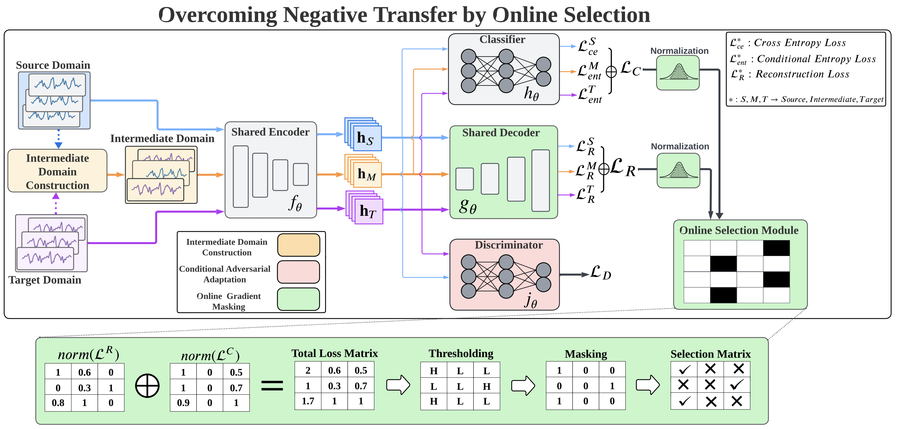

# OSAA
This is the PyTorch implementation of manuscript 'Overcoming Negative Transfer by Online Selection: Distant Domain Adaptation for Fault Diagnosis'


## Architecture of Re2LLM


## Packages to be installed
```
pip install torch
pip install torchvision
pip install matplotlib
pip install seaborn
pip install pandas
pip install scorch
pip install wandb -U
pip install openpyxl
```

## Training
```
cd OSAA
mkdir PU
```
Download the data from https://drive.google.com/file/d/1a0StnzWNabPyVAUMPax-R3mEYlPUXkS9/view?usp=sharing and put them into folder PU


## Training


- Open main.py to check for training potions in the parser
- Look for more configurations in folder config
- Run the following command:

```
python main.py
```


