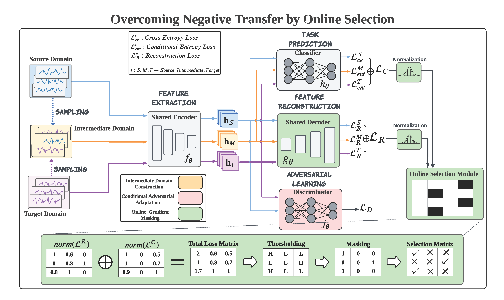

# OSAA
This is the PyTorch implementation of manuscript 'Overcoming Negative Transfer by Online Selection: Distant Domain Adaptation for Fault Diagnosis'


## Architecture of OSAA


## Packages to be installed
```
pip install torch
pip install torchvision
pip install matplotlib
pip install seaborn
pip install pandas
pip install scorch
pip install wandb -U
pip install openpyxl
```

## Training
```
cd OSAA
mkdir PU
mkdir CWRU
```
Download from https://drive.google.com/file/d/1a0StnzWNabPyVAUMPax-R3mEYlPUXkS9/view?usp=sharing and put them into folder PU (parallel to main.py)


Download from https://drive.google.com/file/d/1Urp5AzZi79hs-u0_wJOIlQHvB070q6Ag/view?usp=sharing and put them into folder CWRU


## Training


- Open main.py to check for training potions in the parser
- Look for more configurations in folder config
- Run the following command:

```
python main.py
```

An example is 
```
python main.py --dataset PU --experiment_description test
```


